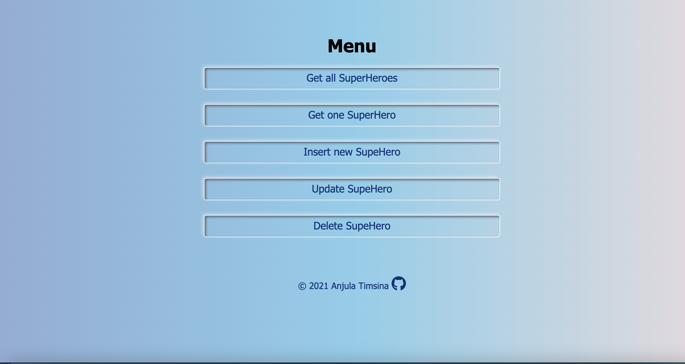

# Ghale_Timsina_superhero_project.

This is the project created with express which is node.js module available through npm.

## Package.json file for app

### **manually**

- name and version required

### **with npm `init`**

```shell
npm init -y
```

## install all libraries

```shell
npm install express ejs
```

Installed libraries will be in the node_modules folder

## json file for the data

- Json array with superhero object inside it and superhero object has properties like heroId, name, strength, custom, and yearOfBirth.

```Json
[
  {
	"heroID":5,
	"name":"SuperGenius",
	"strength":"****",
	"costume":"data-outfit",
	"yearOfBirth":2012
  },
  {
	"heroID":7,
	"name":"SteelFoot",
	"strength":"*",
	"costume":"brown",
	"yearOfBirth":1960
  },
]
```

### readWrite file

- using fs pacakge reading and writing of json data is done.

### supHeroStorageLayer

- This is the lower level storage. Async function are used to read and modify json data from storage.

### supHeroAccessLayer

- is higher level storage layer.

- getAll()

  - returns an array of all superheroes / []

- getOne(id)

  - returns an superhero object / NOT_FOUND

- insert(newSuperhero)

  - returns INSERT_OK / NOT_INSERTED / ALREADY_IN_USE

- update(updatedSuperheroe)

  - returns UPDATE_OK / NOT_UPDATED

- remove(id)

  - returns REMOVE_OK / NOT_FOUND / NOT_REMOVED

### Pages

- Include all webpage templates in ejs format.

## Screenshot



## Technologies used

- Express
- Ejs

## Authors and acknowledgment

Anjula Timsina

- [GitHub](https://github.com/meanjula)
- [linkedIn](https://www.linkedin.com/in/meanjula/)
